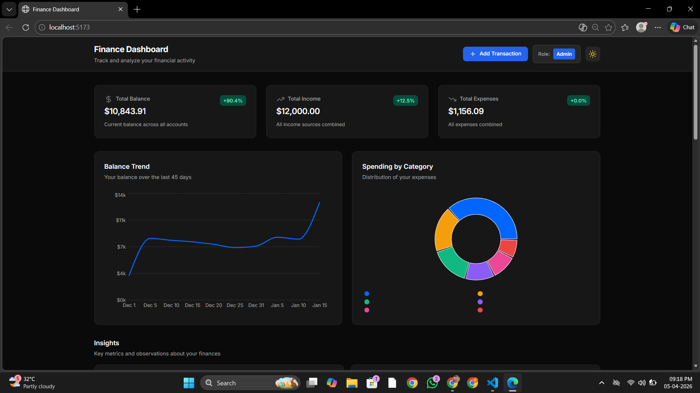
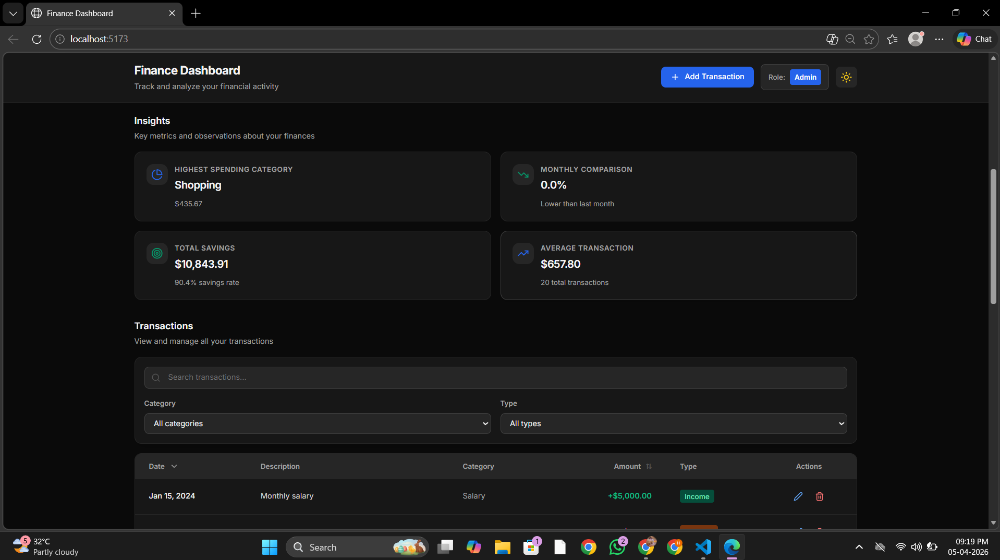
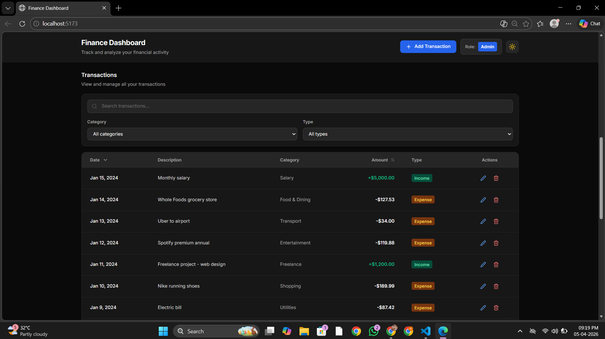
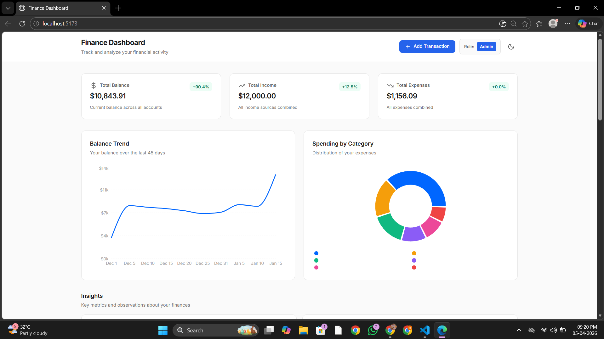
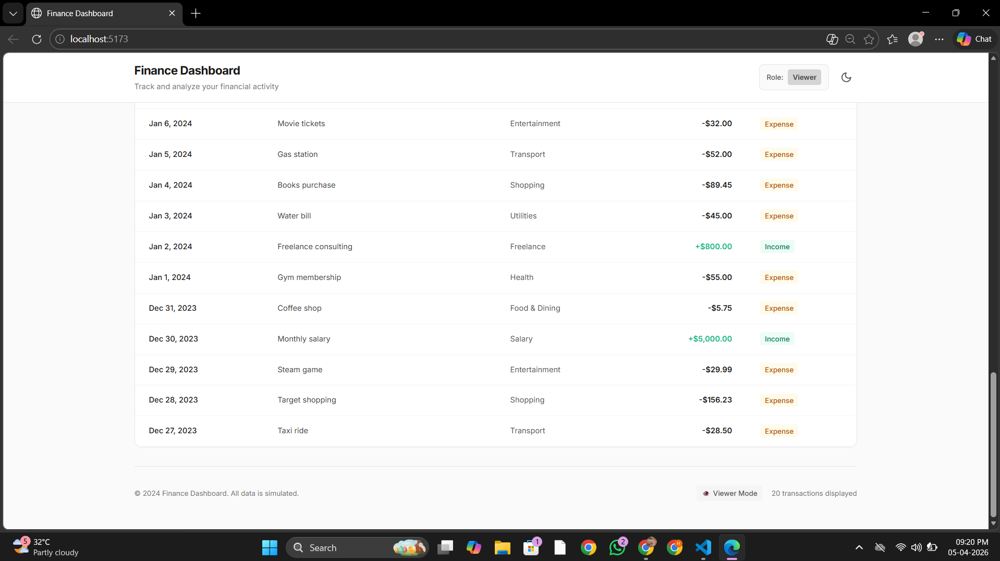

# Finance Dashboard

A modern, full-featured personal finance management dashboard built with React, TypeScript, and Tailwind CSS. Track transactions, analyze spending patterns, and manage your finances with an intuitive and responsive interface.


## Features

### Core Features

#### Transaction Management
- **View all transactions** with detailed information (date, amount, category, type)
- **Add new transactions** with modal form interface (admin only)
- **Edit existing transactions** to correct or update information (admin only)
- **Delete transactions** with confirmation (admin only)
- **Sortable table** - click headers to sort by date or amount
- **Persistent storage** - transactions saved to browser localStorage

#### Analytics & Insights
- **Balance Trend Chart** - visualize balance changes over 45 days with line chart
- **Category Spending Pie Chart** - see spending distribution across categories
- **Highest Spending Category** - identifies your top expense area
- **Monthly Comparison** - compare current vs previous month expenses
- **Total Savings** - displays overall savings with savings rate percentage
- **Average Transaction** - calculates average transaction size
- **Total Balance, Income, and Expenses** - key metrics at a glance

#### Search & Filter
- **Transaction search** - find transactions by description in real-time
- **Category filter** - filter by specific spending categories
- **Type filter** - separate income and expense transactions
- **Combined filtering** - use multiple filters simultaneously
- **Clear filters** - quick reset button to remove all filters
- **Scroll trigger** - filter card elevates with shadow on scroll for better UX

#### Role-Based Access
- **Admin mode** - full access to add, edit, and delete transactions
- **Viewer mode** - read-only access to view all data
- **Easy role switching** - toggle between admin and viewer modes
- **Permission checking** - sensitive operations protected by role validation

#### Dark Mode
- **Light/Dark theme toggle** - switch themes with button in header
- **System preference detection** - respects user's OS theme preference
- **Persistent theme** - theme preference saved to localStorage
- **Complete UI coverage** - all components styled for both modes
- **Accessible colors** - WCAG AA compliant color contrasts


## Technology Stack

### Frontend Framework
- **React 18.2.0** - Modern UI library with hooks support
- **TypeScript 5.2.2** - Type-safe JavaScript for development confidence
- **Vite 5.0.0** - Next-generation build tool for fast development and production builds

### State Management
- **Zustand 4.4.0** - Lightweight state management with persistence middleware
- **LocalStorage** - Browser storage for data persistence across sessions

### Styling & Design
- **Tailwind CSS 3.3.0** - Utility-first CSS framework for rapid UI development
- **PostCSS 8.4.31** - CSS transformation and processing
- **Autoprefixer 10.4.16** - Vendor prefix automation for cross-browser compatibility

### Charting & Visualization
- **Recharts 2.10.0** - React component library for composable charts
- **Line Chart** - balance trend visualization
- **Pie Chart** - category spending distribution

### Icons & UI
- **Lucide React 0.294.0** - Beautiful, consistent icon library
- **Responsive SVG icons** - scale perfectly on all devices

### Development Tools
- **@vitejs/plugin-react 4.2.0** - React plugin for Vite
- **@types/react & @types/react-dom** - TypeScript type definitions


## Project Structure

```
finance-dashboard/
├── src/
│   ├── components/              # Reusable React components
│   │   ├── Header.tsx           # Navigation & controls header
│   │   ├── SummaryCard.tsx       # Reusable metric card component
│   │   ├── BalanceTrendChart.tsx # Line chart for balance trends
│   │   ├── CategorySpendingChart.tsx # Pie chart for spending distribution
│   │   ├── TransactionsTable.tsx # Data table with sorting
│   │   ├── FilterControls.tsx    # Search and filter interface
│   │   ├── InsightsSection.tsx   # Metrics and insights display
│   │   └── TransactionModal.tsx  # Add/edit transaction form
│   │
│   ├── store/
│   │   └── appStore.ts          # Zustand global state store
│   │
│   ├── hooks/
│   │   └── useTransactionMutations.ts # Custom hook for CRUD operations
│   │
│   ├── types/
│   │   └── index.ts             # TypeScript interfaces and types
│   │
│   ├── data/
│   │   └── mockData.ts          # Sample data for demonstration
│   │
│   ├── utils/
│   │   ├── formatting.ts        # Currency, date, and label formatting
│   │   ├── analytics.ts         # Advanced analytics calculations
│   │   ├── budget.ts            # Budget tracking utilities
│   │   ├── export.ts            # Data export functions
│   │   └── testing.ts           # Testing and data generation utilities
│   │
│   ├── App.tsx                  # Root component
│   ├── main.tsx                 # React entry point
│   └── index.css                # Global styles and Tailwind imports
│
├── Configuration Files
│   ├── package.json             # Dependencies and scripts
│   ├── tsconfig.json            # TypeScript configuration
│   ├── vite.config.ts           # Vite build configuration
│   ├── tailwind.config.js       # Tailwind design tokens
│   └── postcss.config.js        # PostCSS pipeline
│
├── index.html                   # HTML entry point
├── .gitignore                   # Git ignore rules
└── .env.example                 # Environment variables template
```


## Getting Started

### Prerequisites

Make sure your environment has:

- **Node.js** v18.0.0 or higher
- **npm** v9.0.0 or higher (or yarn/pnpm)
- Git for version control

### Setup Instructions

1. **Clone the repository**
   ```bash
   git clone https://github.com/Harikumarb1210/Finance-Dashboard-UI.git
   cd Finance-Dashboard-UI
   ```

2. **Install dependencies**
   ```bash
   npm install
   ```
   This installs all required packages including React, Zustand, Recharts, Tailwind CSS, and TypeScript.

3. **Start development server**
   ```bash
   npm run dev
   ```
   The application will start on `http://localhost:5173`

4. **Open in browser**
   - Navigate to `http://localhost:5173`
   - You'll see the dashboard with sample transaction data
   - Start by switching to "Admin" mode to test adding/editing transactions


## Screenshots
 
### Dashboard Overview (Dark Mode)
The main dashboard displays key financial metrics and interactive charts for comprehensive financial analysis.
 

 
### Insights & Metrics (Dark Mode)
View detailed insights including highest spending category, monthly comparison, total savings, and average transaction size.
 

 
### Transactions Table (Dark Mode)
Manage all your transactions with sortable columns, search functionality, and quick action buttons for editing or deleting entries.
 

 
### Light Mode
The application supports both light and dark themes with a seamless toggle in the header.
 




## Usage
 
### Basic Workflow
 
1. **View Dashboard**
   - See all metrics: Total Balance, Income, Expenses
   - View balance trend chart (last 45 days)
   - See spending distribution by category
   - Review key insights (highest spending, monthly comparison, etc.)
 
2. **Manage Transactions (Admin Mode)**
   - Click "Add Transaction" button to create new transaction
   - Fill in amount, category, type (income/expense), date
   - Click Save to add transaction
   - Click edit icon (pencil) in table to modify transactions
   - Click delete icon (trash) to remove transactions
   - Changes persist across browser sessions
 
3. **Search & Filter**
   - Use search box to find transactions by description
   - Select category filter to show specific categories
   - Select type filter to show only income or expense
   - Multiple filters work together
   - Click "Clear all" to reset filters
 
4. **Switch Roles**
   - Click "Viewer" or "Admin" button in header
   - Viewer mode: read-only access
   - Admin mode: full CRUD permissions (Add, Edit, Delete)
 
5. **Dark Mode**
   - Click sun/moon icon in header to toggle dark mode
   - Theme preference is saved automatically
   - All UI components support both modes perfectly
 
### Sample Data
 
The application comes with 20 pre-loaded sample transactions including:
- Monthly salary ($5,000)
- Various expense categories (Shopping, Transport, Utilities, etc.)
- Freelance income ($800)
- Multiple transaction types for demonstration.
 

## Development 
 
### Running in Development Mode
```bash
npm run dev
```
- Hot module replacement (HMR) for instant feedback
- Fast refresh for React components
- TypeScript type checking
- Development server at `http://localhost:5173`


### Code Quality
- **TypeScript** - Full type safety across codebase
- **Component-driven** - Each component has single responsibility
- **Reusable patterns** - DRY principle throughout
- **Consistent naming** - Clear, semantic naming conventions
